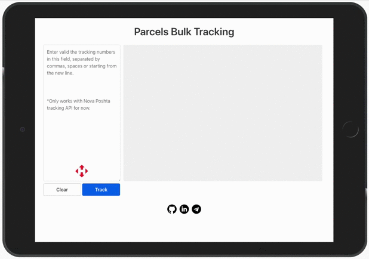

# 📦 Parcel Tracking
Parcels bulk tracking pet-project. Only works with Nova Poshta API for now.



This repo is not contain config.js file with Nova Poshta API key. To work with this project you should:
1. Generate your own API key on [Nova Poshta Dev Center](https://devcenter.novaposhta.ua/)
2. Create config.js file in root folder with:
```javascript
const config = {
    NP_KEY: 'Place here your own API key'
}
```

**Technology used:**
* HTML
* CSS
* JavaScript